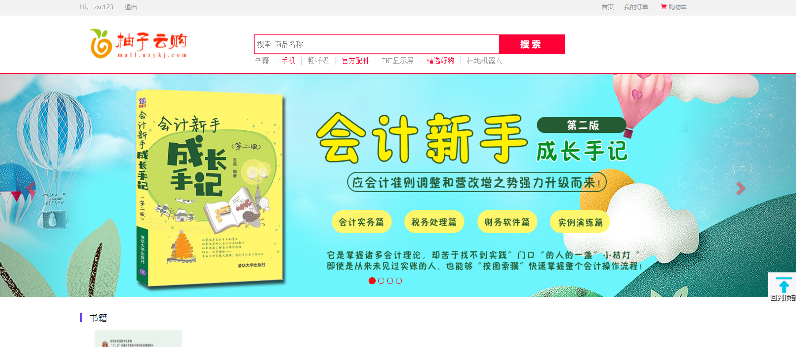
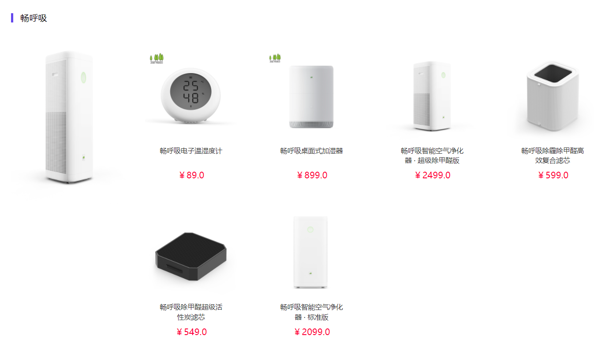
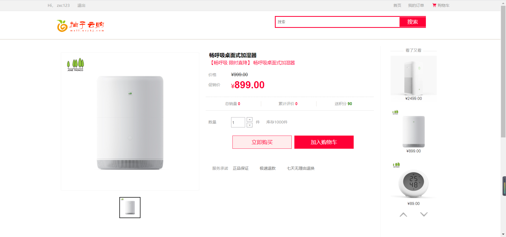
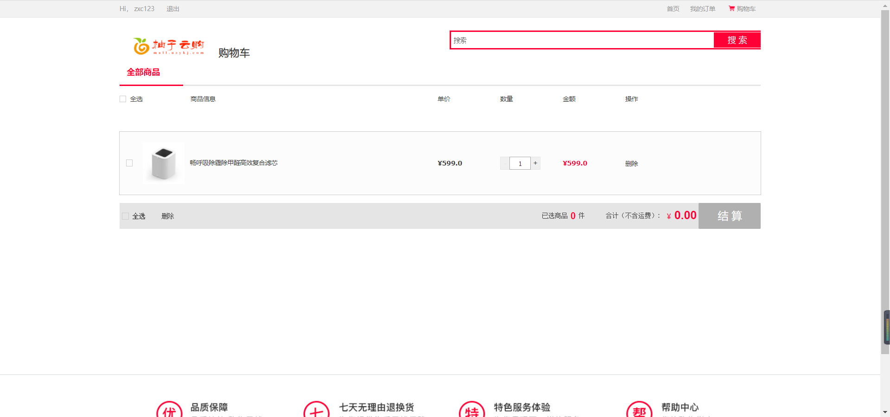
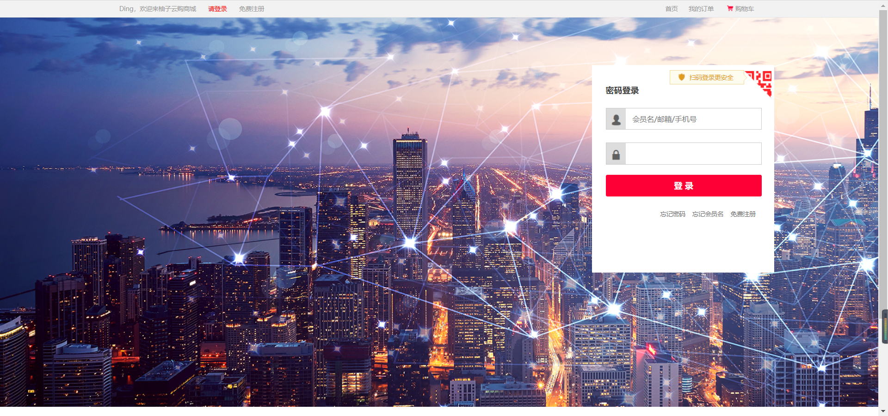
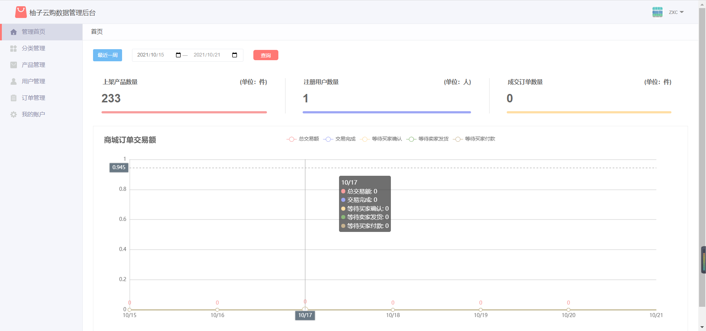
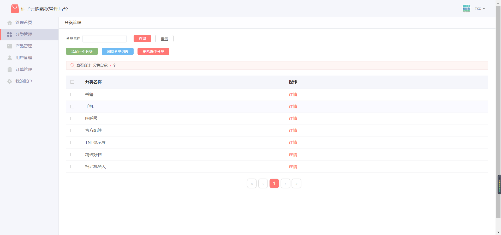

# 柚子云电子商城

## 项目介绍
基于Springboot框架搭建的电子商务平台手脚架，静态资源储存可使用OSS ([七牛云-对象存储](https://www.qiniu.com/products/kodo)) ，
也可以使用本地文件服务器，支付渠道采用微信、支付宝支付。

### 展示
#### 前台展示
首页

分类

列表

商品

购物车

订单

登录

#### 后台展示
首页

分类

### 技术介绍

### 技术要点
- [x] 后端框架
    - Springboot      2.1.4
    - Mybatis         3.5.7
    - Mybatis Plus    3.4
    - Druid           1.2.8
    - Mysql           5.6
    - log4j
    - qiniu
  
- [x] 页面模版样式
    - JSP
    - bootstrap
    - jQuery
    - echarts

- [x] 支付类型
    - 微信
    - 支付宝

### 部署
- sql文件目录`documents/db/uzymall.sql`，添加到自己的数据库中。
- 修改`src/main/resources/application.yml`文件中数据库连接信息
- 启动`src/main/java/com/uzykj/mall/MallApplication.java`Springboot启动类

### 访问
- 前台地址：[http://127.0.0.1:8080/mall](http://127.0.0.1:8010/mall)

- 后台管理：[http://127.0.0.1:8080/mall/admin](http://127.0.0.1:8010/mall/admin)

### MIT

## 贡献者们

> 感谢所有的贡献者们！

## Star历史

